**ASSIGNMENT 2 - Install the LAMP & LEMP Stack or Web Server on my EC2
Instance.**

**LAMP STACK INSTALLATION**

**STEP 1 - ssh into my instance**

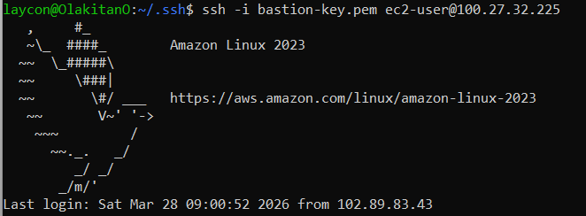

**STEP 2 - Performed a quick software update of dependencies on my
instance**

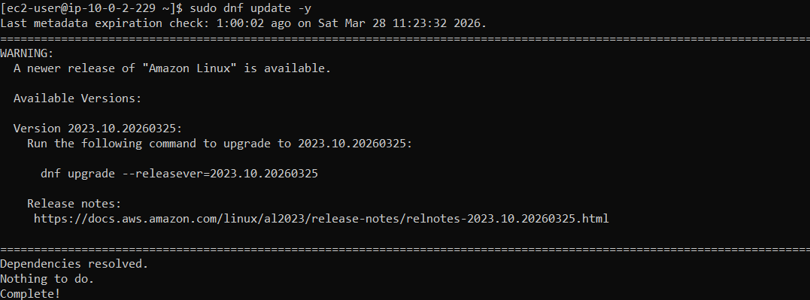

**STEP 3 - Installed the Database -MariaDB**

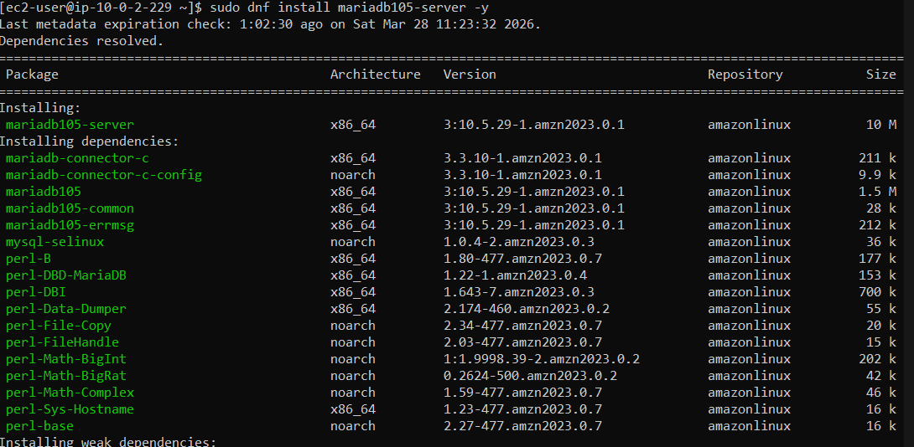

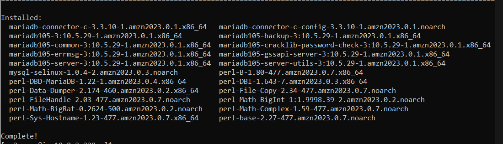

**STEP 4 - Installed Apache Web Server**

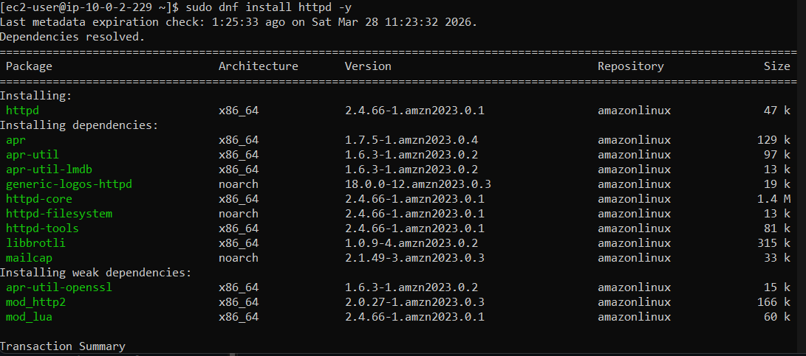

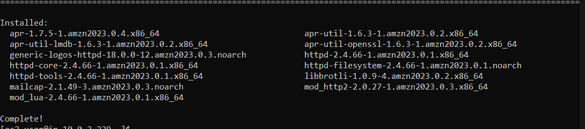

**STEP 5 - Installed the PHP software**

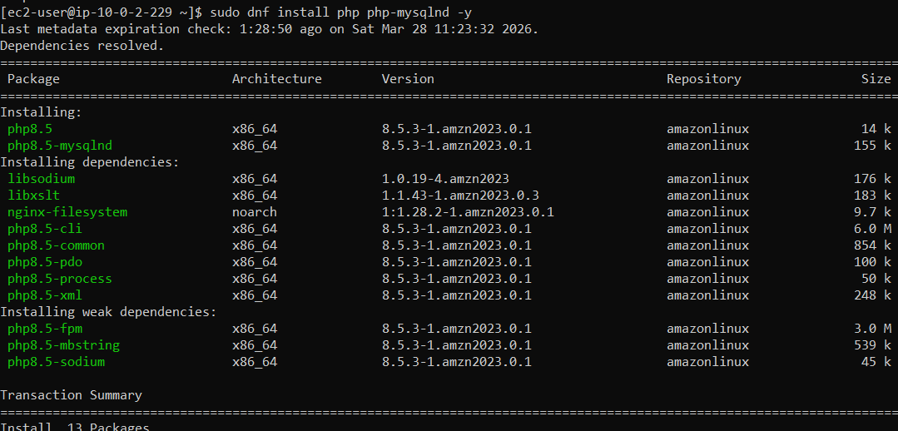

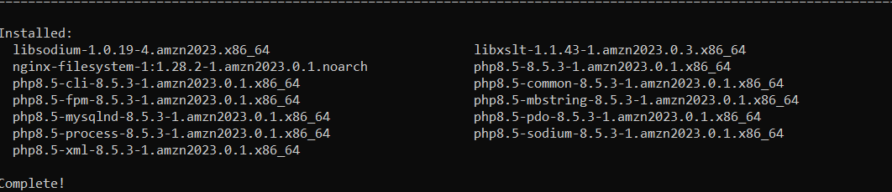

**STEP 6 - Started the Apache web server**

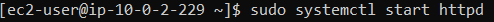

**STEP 7 - Configured the Apache web server to always start at each
system boot.**

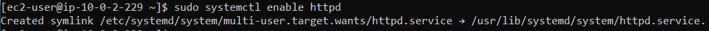

**STEP 8 - Ensured my vpc security group and my instance NACL allowed
inbound Http port 80 traffic**

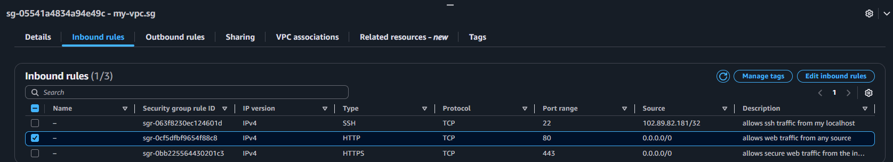

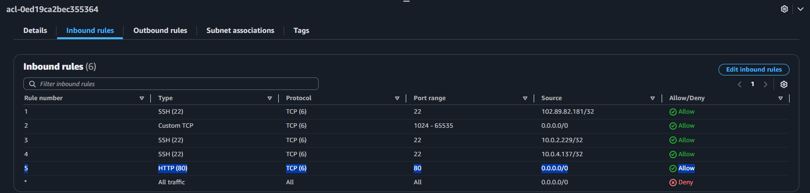

**STEP 9 - Typed in my EC2 instance public IP address in the browser**

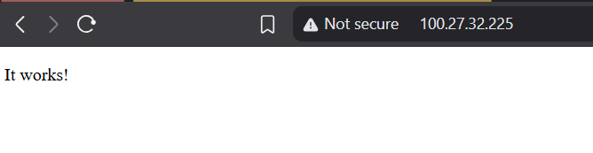

N.B - The traffic btw the web server and browser is not secured because
Apache doesn't configure SSL by default.

**LEMP INSTALLATION**

**STEP 1 - ssh into my instance and ran the command to install nginx**

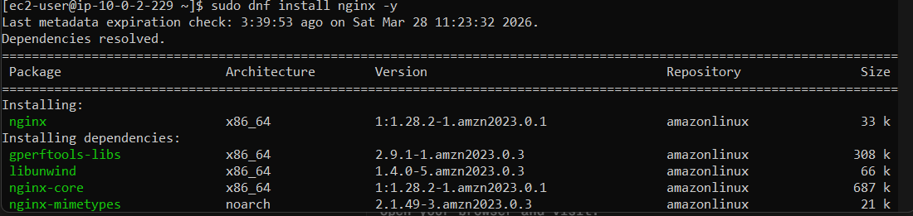

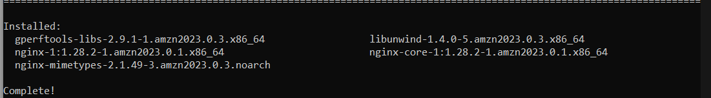

STEP 2 - Started the nginx web server but got an error

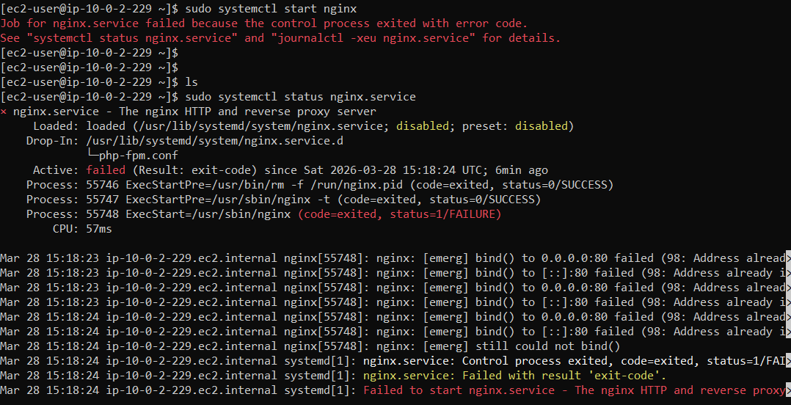{width="5.760416666666667in" height="2.95in"}

This was because Apache was occupying port 80. So, I stopped the Apache
web server before spinning up the nginx again

STEP 3 - Stopped the Apache web server

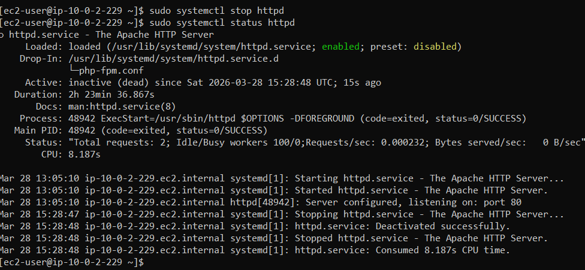

STEP 4 - Nginx Web Server started successfully

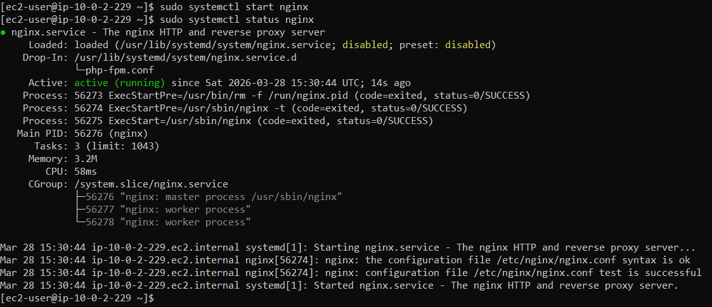

Nginx successfully deployed with EC2 instance public IP

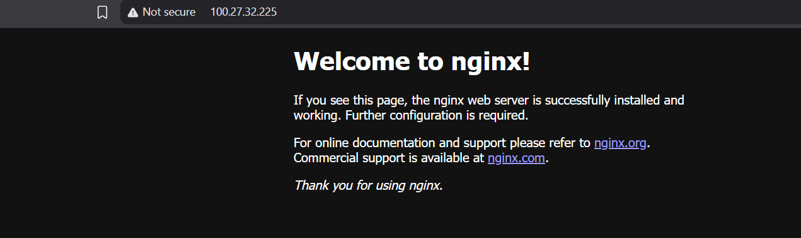
